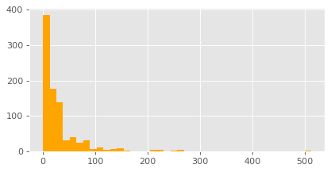
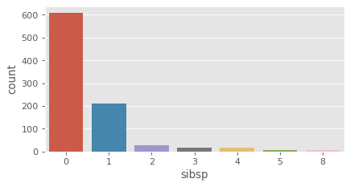
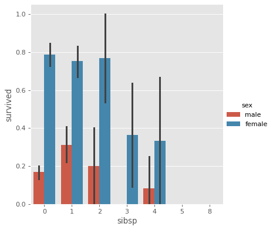
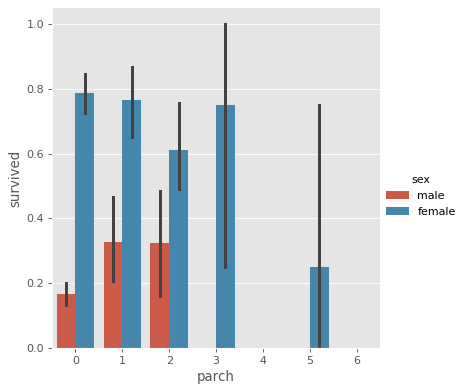
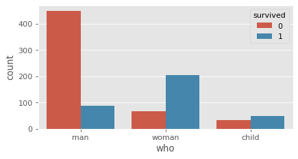

# Analysing Titanic Dataset

## Load Dataset


```python
import numpy as np
import pandas as pd
import matplotlib.pyplot as plt
import seaborn as sns

%matplotlib inline
```


```python
plt.rcParams['figure.figsize'] = [6, 3]
plt.rcParams['figure.dpi'] = 80
```


```python
titanic = sns.load_dataset('titanic')
```


```python
titanic.head()
```


<div>
<style scoped>
    .dataframe tbody tr th:only-of-type {
        vertical-align: middle;
    }

    .dataframe tbody tr th {
        vertical-align: top;
    }

    .dataframe thead th {
        text-align: right;
    }
</style>
<table border="1" class="dataframe">
  <thead>
    <tr style="text-align: right;">
      <th></th>
      <th>survived</th>
      <th>pclass</th>
      <th>sex</th>
      <th>age</th>
      <th>sibsp</th>
      <th>parch</th>
      <th>fare</th>
      <th>embarked</th>
      <th>class</th>
      <th>who</th>
      <th>adult_male</th>
      <th>deck</th>
      <th>embark_town</th>
      <th>alive</th>
      <th>alone</th>
    </tr>
  </thead>
  <tbody>
    <tr>
      <th>0</th>
      <td>0</td>
      <td>3</td>
      <td>male</td>
      <td>22.0</td>
      <td>1</td>
      <td>0</td>
      <td>7.2500</td>
      <td>S</td>
      <td>Third</td>
      <td>man</td>
      <td>True</td>
      <td>NaN</td>
      <td>Southampton</td>
      <td>no</td>
      <td>False</td>
    </tr>
    <tr>
      <th>1</th>
      <td>1</td>
      <td>1</td>
      <td>female</td>
      <td>38.0</td>
      <td>1</td>
      <td>0</td>
      <td>71.2833</td>
      <td>C</td>
      <td>First</td>
      <td>woman</td>
      <td>False</td>
      <td>C</td>
      <td>Cherbourg</td>
      <td>yes</td>
      <td>False</td>
    </tr>
    <tr>
      <th>2</th>
      <td>1</td>
      <td>3</td>
      <td>female</td>
      <td>26.0</td>
      <td>0</td>
      <td>0</td>
      <td>7.9250</td>
      <td>S</td>
      <td>Third</td>
      <td>woman</td>
      <td>False</td>
      <td>NaN</td>
      <td>Southampton</td>
      <td>yes</td>
      <td>True</td>
    </tr>
    <tr>
      <th>3</th>
      <td>1</td>
      <td>1</td>
      <td>female</td>
      <td>35.0</td>
      <td>1</td>
      <td>0</td>
      <td>53.1000</td>
      <td>S</td>
      <td>First</td>
      <td>woman</td>
      <td>False</td>
      <td>C</td>
      <td>Southampton</td>
      <td>yes</td>
      <td>False</td>
    </tr>
    <tr>
      <th>4</th>
      <td>0</td>
      <td>3</td>
      <td>male</td>
      <td>35.0</td>
      <td>0</td>
      <td>0</td>
      <td>8.0500</td>
      <td>S</td>
      <td>Third</td>
      <td>man</td>
      <td>True</td>
      <td>NaN</td>
      <td>Southampton</td>
      <td>no</td>
      <td>True</td>
    </tr>
  </tbody>
</table>
</div>


```python
cols = titanic.columns
cols
```


    Index(['survived', 'pclass', 'sex', 'age', 'sibsp', 'parch', 'fare',
           'embarked', 'class', 'who', 'adult_male', 'deck', 'embark_town',
           'alive', 'alone'],
          dtype='object')


```python
titanic.describe()
```


<div>
<style scoped>
    .dataframe tbody tr th:only-of-type {
        vertical-align: middle;
    }

    .dataframe tbody tr th {
        vertical-align: top;
    }

    .dataframe thead th {
        text-align: right;
    }
</style>
<table border="1" class="dataframe">
  <thead>
    <tr style="text-align: right;">
      <th></th>
      <th>survived</th>
      <th>pclass</th>
      <th>age</th>
      <th>sibsp</th>
      <th>parch</th>
      <th>fare</th>
    </tr>
  </thead>
  <tbody>
    <tr>
      <th>count</th>
      <td>891.000000</td>
      <td>891.000000</td>
      <td>714.000000</td>
      <td>891.000000</td>
      <td>891.000000</td>
      <td>891.000000</td>
    </tr>
    <tr>
      <th>mean</th>
      <td>0.383838</td>
      <td>2.308642</td>
      <td>29.699118</td>
      <td>0.523008</td>
      <td>0.381594</td>
      <td>32.204208</td>
    </tr>
    <tr>
      <th>std</th>
      <td>0.486592</td>
      <td>0.836071</td>
      <td>14.526497</td>
      <td>1.102743</td>
      <td>0.806057</td>
      <td>49.693429</td>
    </tr>
    <tr>
      <th>min</th>
      <td>0.000000</td>
      <td>1.000000</td>
      <td>0.420000</td>
      <td>0.000000</td>
      <td>0.000000</td>
      <td>0.000000</td>
    </tr>
    <tr>
      <th>25%</th>
      <td>0.000000</td>
      <td>2.000000</td>
      <td>20.125000</td>
      <td>0.000000</td>
      <td>0.000000</td>
      <td>7.910400</td>
    </tr>
    <tr>
      <th>50%</th>
      <td>0.000000</td>
      <td>3.000000</td>
      <td>28.000000</td>
      <td>0.000000</td>
      <td>0.000000</td>
      <td>14.454200</td>
    </tr>
    <tr>
      <th>75%</th>
      <td>1.000000</td>
      <td>3.000000</td>
      <td>38.000000</td>
      <td>1.000000</td>
      <td>0.000000</td>
      <td>31.000000</td>
    </tr>
    <tr>
      <th>max</th>
      <td>1.000000</td>
      <td>3.000000</td>
      <td>80.000000</td>
      <td>8.000000</td>
      <td>6.000000</td>
      <td>512.329200</td>
    </tr>
  </tbody>
</table>
</div>


```python
titanic.info()
```

    <class 'pandas.core.frame.DataFrame'>
    RangeIndex: 891 entries, 0 to 890
    Data columns (total 15 columns):
     #   Column       Non-Null Count  Dtype   
    ---  ------       --------------  -----   
     0   survived     891 non-null    int64   
     1   pclass       891 non-null    int64   
     2   sex          891 non-null    object  
     3   age          714 non-null    float64 
     4   sibsp        891 non-null    int64   
     5   parch        891 non-null    int64   
     6   fare         891 non-null    float64 
     7   embarked     889 non-null    object  
     8   class        891 non-null    category
     9   who          891 non-null    object  
     10  adult_male   891 non-null    bool    
     11  deck         203 non-null    category
     12  embark_town  889 non-null    object  
     13  alive        891 non-null    object  
     14  alone        891 non-null    bool    
    dtypes: bool(2), category(2), float64(2), int64(4), object(5)
    memory usage: 80.6+ KB


## Heatmap


```python
plt.style.use('ggplot')
```


```python
titanic.isnull().sum()
```


    survived         0
    pclass           0
    sex              0
    age            177
    sibsp            0
    parch            0
    fare             0
    embarked         2
    class            0
    who              0
    adult_male       0
    deck           688
    embark_town      2
    alive            0
    alone            0
    dtype: int64


```python
sns.heatmap(titanic.isnull(), cmap = 'viridis', cbar = True)
```


    <matplotlib.axes._subplots.AxesSubplot at 0x10a793820>


```python
corrmat = titanic.corr()
corrmat
```


<div>
<style scoped>
    .dataframe tbody tr th:only-of-type {
        vertical-align: middle;
    }

    .dataframe tbody tr th {
        vertical-align: top;
    }

    .dataframe thead th {
        text-align: right;
    }
</style>
<table border="1" class="dataframe">
  <thead>
    <tr style="text-align: right;">
      <th></th>
      <th>survived</th>
      <th>pclass</th>
      <th>age</th>
      <th>sibsp</th>
      <th>parch</th>
      <th>fare</th>
      <th>adult_male</th>
      <th>alone</th>
    </tr>
  </thead>
  <tbody>
    <tr>
      <th>survived</th>
      <td>1.000000</td>
      <td>-0.338481</td>
      <td>-0.077221</td>
      <td>-0.035322</td>
      <td>0.081629</td>
      <td>0.257307</td>
      <td>-0.557080</td>
      <td>-0.203367</td>
    </tr>
    <tr>
      <th>pclass</th>
      <td>-0.338481</td>
      <td>1.000000</td>
      <td>-0.369226</td>
      <td>0.083081</td>
      <td>0.018443</td>
      <td>-0.549500</td>
      <td>0.094035</td>
      <td>0.135207</td>
    </tr>
    <tr>
      <th>age</th>
      <td>-0.077221</td>
      <td>-0.369226</td>
      <td>1.000000</td>
      <td>-0.308247</td>
      <td>-0.189119</td>
      <td>0.096067</td>
      <td>0.280328</td>
      <td>0.198270</td>
    </tr>
    <tr>
      <th>sibsp</th>
      <td>-0.035322</td>
      <td>0.083081</td>
      <td>-0.308247</td>
      <td>1.000000</td>
      <td>0.414838</td>
      <td>0.159651</td>
      <td>-0.253586</td>
      <td>-0.584471</td>
    </tr>
    <tr>
      <th>parch</th>
      <td>0.081629</td>
      <td>0.018443</td>
      <td>-0.189119</td>
      <td>0.414838</td>
      <td>1.000000</td>
      <td>0.216225</td>
      <td>-0.349943</td>
      <td>-0.583398</td>
    </tr>
    <tr>
      <th>fare</th>
      <td>0.257307</td>
      <td>-0.549500</td>
      <td>0.096067</td>
      <td>0.159651</td>
      <td>0.216225</td>
      <td>1.000000</td>
      <td>-0.182024</td>
      <td>-0.271832</td>
    </tr>
    <tr>
      <th>adult_male</th>
      <td>-0.557080</td>
      <td>0.094035</td>
      <td>0.280328</td>
      <td>-0.253586</td>
      <td>-0.349943</td>
      <td>-0.182024</td>
      <td>1.000000</td>
      <td>0.404744</td>
    </tr>
    <tr>
      <th>alone</th>
      <td>-0.203367</td>
      <td>0.135207</td>
      <td>0.198270</td>
      <td>-0.584471</td>
      <td>-0.583398</td>
      <td>-0.271832</td>
      <td>0.404744</td>
      <td>1.000000</td>
    </tr>
  </tbody>
</table>
</div>


```python
sns.heatmap(corrmat)
```


    <matplotlib.axes._subplots.AxesSubplot at 0x11f7bd5e0>


## Univariate Analysis


```python
print(list(cols))
```

    ['survived', 'pclass', 'sex', 'age', 'sibsp', 'parch', 'fare', 'embarked', 'class', 'who', 'adult_male', 'deck', 'embark_town', 'alive', 'alone']


```python
fig, ax = plt.subplots(3, 3, figsize = (16, 16))

sns.countplot('survived', data = titanic, ax = ax[0][0])
sns.countplot('pclass', data = titanic, ax = ax[0][1])
sns.countplot('sex', data = titanic, ax = ax[0][2])
sns.countplot('sibsp', data = titanic, ax = ax[1][0])
sns.countplot('parch', data = titanic, ax = ax[1][1])
sns.countplot('embarked', data = titanic, ax = ax[1][2])
sns.countplot('alone', data = titanic, ax = ax[2][0])

sns.distplot(titanic['fare'], kde = True, ax = ax[2][1])
sns.distplot(titanic['age'], kde = True, ax = ax[2][2])

plt.tight_layout()
```


## Survived


```python
titanic['survived'].value_counts()
```


    0    549
    1    342
    Name: survived, dtype: int64


```python
sns.countplot('survived', data = titanic)
plt.title('Titanic Survival Plot')
plt.show()
```


```python
titanic['survived'].plot.hist()
```


    <matplotlib.axes._subplots.AxesSubplot at 0x120f43100>


```python
titanic['survived'].value_counts().plot.pie()
```


    <matplotlib.axes._subplots.AxesSubplot at 0x120fc0820>


```python
titanic['survived'].value_counts().plot.pie(autopct = '%1.2f%%')
```


    <matplotlib.axes._subplots.AxesSubplot at 0x11f908730>


```python
explode = [0, 0.1]
titanic['survived'].value_counts().plot.pie(explode = explode, autopct = '%1.2f%%')
```


    <matplotlib.axes._subplots.AxesSubplot at 0x11fba1790>


## PClass


```python
titanic['pclass'].value_counts()
```


    3    491
    1    216
    2    184
    Name: pclass, dtype: int64


```python
titanic.groupby(['pclass', 'survived'])['survived'].count()
```


    pclass  survived
    1       0            80
            1           136
    2       0            97
            1            87
    3       0           372
            1           119
    Name: survived, dtype: int64


```python
sns.countplot('pclass', data = titanic)
```


    <matplotlib.axes._subplots.AxesSubplot at 0x120e8b640>


```python
sns.countplot('pclass', data = titanic, hue = 'survived')
```


    <matplotlib.axes._subplots.AxesSubplot at 0x11fc178b0>


```python
titanic['pclass'].value_counts().plot.pie(autopct = "%1.1f%%")
```


    <matplotlib.axes._subplots.AxesSubplot at 0x1211338b0>


```python
sns.catplot(x = 'pclass', y = 'survived', kind = 'bar', data = titanic)
```


    <seaborn.axisgrid.FacetGrid at 0x11f95ba60>


```python
sns.catplot(x = 'pclass', y = 'survived', kind = 'point', data = titanic)
```


    <seaborn.axisgrid.FacetGrid at 0x121133940>


```python
sns.catplot(x = 'pclass', y = 'survived', kind = 'violin', data= titanic)
```


    <seaborn.axisgrid.FacetGrid at 0x11f9c51f0>


## Sex


```python
titanic['sex'].value_counts()
```


    male      577
    female    314
    Name: sex, dtype: int64


```python
titanic.groupby(['sex', 'survived'])['survived'].count()
```


    sex     survived
    female  0            81
            1           233
    male    0           468
            1           109
    Name: survived, dtype: int64


```python
sns.countplot('sex', data = titanic)
```


    <matplotlib.axes._subplots.AxesSubplot at 0x1215bcd90>


```python
sns.countplot('sex', data = titanic, hue = 'survived')
```


    <matplotlib.axes._subplots.AxesSubplot at 0x121715d00>


```python
titanic['sex'].value_counts().plot.pie(autopct = '%1.1f%%')
```


    <matplotlib.axes._subplots.AxesSubplot at 0x1216bc340>


```python
sns.catplot(x = 'sex', y = 'survived', kind = 'bar', data = titanic)
```


    <seaborn.axisgrid.FacetGrid at 0x1216bcaf0>


```python
sns.catplot(x = 'sex', y = 'survived', kind = 'bar', data = titanic, hue = 'pclass')
```


    <seaborn.axisgrid.FacetGrid at 0x1217dc100>


```python
sns.catplot(x = 'sex', y = 'survived', kind = 'bar', data = titanic, col = 'pclass')
```


    <seaborn.axisgrid.FacetGrid at 0x121b72d90>


```python
sns.catplot(x = 'sex', y = 'survived', kind = 'bar', data = titanic, row = 'pclass')
```


    <seaborn.axisgrid.FacetGrid at 0x10b801fa0>


```python
sns.catplot(x = 'pclass', y = 'survived', kind = 'bar', data = titanic, col = 'sex')
```


    <seaborn.axisgrid.FacetGrid at 0x122407640>


```python
sns.catplot(x = 'sex', y = 'survived', kind = 'point', data = titanic)
```


    <seaborn.axisgrid.FacetGrid at 0x121b780a0>


```python
sns.catplot(x = 'sex', y = 'survived', kind = 'point', data = titanic, hue = 'pclass')
```


    <seaborn.axisgrid.FacetGrid at 0x1227b5220>


```python
sns.catplot(x = 'pclass', y = 'survived', kind = 'point', data = titanic, hue = 'sex')
```


    <seaborn.axisgrid.FacetGrid at 0x1227e9670>


```python
sns.catplot(x = 'sex', y = 'survived', kind = 'violin', data = titanic)
```


    <seaborn.axisgrid.FacetGrid at 0x122a0a910>


```python
sns.catplot(x = 'sex', y = 'survived', kind = 'violin', data = titanic, hue = 'pclass')
```


    <seaborn.axisgrid.FacetGrid at 0x121d56af0>


```python
sns.catplot(x = 'sex', y = 'survived', kind = 'violin', data = titanic, col = 'pclass')
```


    <seaborn.axisgrid.FacetGrid at 0x123052430>


## Age


```python
titanic['age'].hist(bins = 30, density = True, color = 'orange', figsize = (10, 5))
plt.xlabel('Age')
plt.show()
```


```python
sns.distplot(titanic['age'])
```


    <matplotlib.axes._subplots.AxesSubplot at 0x1234d9dc0>


```python
sns.distplot(titanic['age'], hist = False)
```


    <matplotlib.axes._subplots.AxesSubplot at 0x1239bb490>


```python
sns.kdeplot(titanic['age'], shade = True)
```


    <matplotlib.axes._subplots.AxesSubplot at 0x123a925b0>


```python
sns.catplot(x = 'sex', y = 'age', data = titanic, kind = 'box')
```


    <seaborn.axisgrid.FacetGrid at 0x123b57910>


```python
sns.catplot(x = 'sex', y = 'age', data = titanic, kind = 'box', hue = 'pclass')
```


    <seaborn.axisgrid.FacetGrid at 0x1229459d0>


```python
sns.catplot(x = 'sex', y = 'age', data = titanic, kind = 'box', col = 'pclass')
```


    <seaborn.axisgrid.FacetGrid at 0x122caf700>


```python
sns.catplot(x = 'pclass', y = 'age', data = titanic, kind = 'violin')
```


    <seaborn.axisgrid.FacetGrid at 0x1223ed670>


```python
sns.catplot(x = 'pclass', y = 'age', data = titanic, kind = 'violin', hue = 'sex')
```


    <seaborn.axisgrid.FacetGrid at 0x1240b1b50>


```python
sns.catplot(x = 'pclass', y = 'age', data = titanic, kind = 'violin', hue = 'sex', split = True)
```


    <seaborn.axisgrid.FacetGrid at 0x1245611c0>


```python
sns.catplot(x = 'pclass', y = 'age', data = titanic, kind = 'violin', col = 'sex')
```


    <seaborn.axisgrid.FacetGrid at 0x12293a520>


```python
sns.catplot(x = 'pclass', y = 'age', kind = 'swarm', data = titanic)
```


    <seaborn.axisgrid.FacetGrid at 0x124743940>


```python
sns.catplot(x = 'pclass', y = 'age', kind = 'swarm', data = titanic, col = 'sex')
```


    <seaborn.axisgrid.FacetGrid at 0x12437d610>


```python
sns.catplot(x = 'survived', y = 'age', data = titanic, kind = 'swarm', col = 'sex')
```


    <seaborn.axisgrid.FacetGrid at 0x124aa5670>


```python
sns.catplot(x = 'survived', y = 'age', data = titanic, kind = 'swarm', row = 'sex', col = 'pclass')
```


    <seaborn.axisgrid.FacetGrid at 0x124c23d00>


## Fare


```python
titanic['fare'].hist(bins = 40, color = 'orange')
```


    <matplotlib.axes._subplots.AxesSubplot at 0x12454f550>





```python
sns.distplot(titanic['fare'])
plt.xlabel('Fare')
plt.show()
```


```python
sns.kdeplot(titanic['fare'], shade = True)
```


    <matplotlib.axes._subplots.AxesSubplot at 0x125662730>


```python
sns.catplot(x = 'sex', y = 'fare', data = titanic, kind = 'box')
```


    <seaborn.axisgrid.FacetGrid at 0x12574b430>


```python
sns.catplot(x = 'sex', y = 'fare', data = titanic, kind = 'box', hue = 'pclass')
```


    <seaborn.axisgrid.FacetGrid at 0x1257c52e0>


```python
sns.catplot(x = 'sex', y = 'fare', data = titanic, kind = 'box', col = 'pclass')
```


    <seaborn.axisgrid.FacetGrid at 0x1255bddc0>


```python
sns.catplot(x = 'sex', y = 'fare', data = titanic, kind = 'boxen', col = 'pclass')
```


    <seaborn.axisgrid.FacetGrid at 0x125f1dd90>


```python
sns.catplot(x = 'pclass', y = 'fare', data = titanic, kind = 'swarm', col = 'sex')
```


    <seaborn.axisgrid.FacetGrid at 0x12616e9a0>


```python
sns.catplot(x = 'survived', y = 'fare', data = titanic, kind = 'swarm', col = 'sex')
```


    <seaborn.axisgrid.FacetGrid at 0x125e83ac0>


```python
sns.catplot(x = 'survived', y = 'fare', data = titanic, kind = 'swarm', col = 'pclass')
```


    <seaborn.axisgrid.FacetGrid at 0x125ed7a60>


```python
sns.jointplot(x = 'age', y = 'fare', data = titanic)
```


    <seaborn.axisgrid.JointGrid at 0x125ef60a0>


```python
sns.jointplot(x = 'age', y = 'fare', data = titanic, kind = 'kde')
```


    <seaborn.axisgrid.JointGrid at 0x127271880>


```python
sns.relplot(x = 'age', y = 'fare', data = titanic, row = 'sex', col = 'pclass')
```


    <seaborn.axisgrid.FacetGrid at 0x12292bf70>


## Sibling or Spouse (SibSp)


```python
titanic['sibsp'].value_counts()
```


    0    608
    1    209
    2     28
    4     18
    3     16
    8      7
    5      5
    Name: sibsp, dtype: int64


```python
sns.countplot('sibsp', data = titanic)
```


    <matplotlib.axes._subplots.AxesSubplot at 0x127ad3b80>





```python
sns.countplot('sibsp', data = titanic, hue = 'survived')
```


    <matplotlib.axes._subplots.AxesSubplot at 0x127ec4fd0>


```python
sns.catplot(x = 'sibsp', y = 'survived', kind = 'bar', data = titanic)
```


    <seaborn.axisgrid.FacetGrid at 0x127f63be0>


```python
sns.catplot(x = 'sibsp', y = 'survived', kind = 'bar', data = titanic, hue = 'sex')
```


    <seaborn.axisgrid.FacetGrid at 0x127eb3b50>





```python
sns.catplot(x = 'sibsp', y = 'survived', kind = 'bar', data = titanic, col = 'sex')
```


    <seaborn.axisgrid.FacetGrid at 0x127292a60>


```python
sns.catplot(x = 'sibsp', y = 'survived', kind = 'bar', data = titanic, col = 'pclass')
```


    <seaborn.axisgrid.FacetGrid at 0x122b00610>


```python
sns.catplot(x = 'sibsp', y = 'survived', kind = 'point', data = titanic)
```


    <seaborn.axisgrid.FacetGrid at 0x127a9d6d0>


```python
sns.catplot(x = 'sibsp', y = 'survived', kind = 'point', data = titanic, hue = 'sex')
```


    <seaborn.axisgrid.FacetGrid at 0x127ebd3d0>


```python
sns.catplot(x = 'sibsp', y = 'survived', kind = 'point', data = titanic, col = 'pclass')
```


    <seaborn.axisgrid.FacetGrid at 0x1284db3a0>


```python
sns.catplot(x = 'sibsp', y = 'fare', data = titanic, kind = 'swarm', col = 'sex')
```


    <seaborn.axisgrid.FacetGrid at 0x128062b50>


```python
sns.catplot(x = 'sibsp', y = 'fare', data = titanic, kind = 'swarm', col = 'pclass')
```


    <seaborn.axisgrid.FacetGrid at 0x12913ddc0>


```python
sns.catplot(x = 'sibsp', y = 'fare', data = titanic, kind = 'swarm', col = 'pclass', row = 'sex')
```


    <seaborn.axisgrid.FacetGrid at 0x128c147f0>


## Parch


```python
titanic['parch'].value_counts()
```


    0    678
    1    118
    2     80
    5      5
    3      5
    4      4
    6      1
    Name: parch, dtype: int64


```python
sns.countplot('parch', data = titanic)
```


    <matplotlib.axes._subplots.AxesSubplot at 0x12a0e3d90>


```python
sns.countplot('parch', data = titanic, hue = 'sex')
```


    <matplotlib.axes._subplots.AxesSubplot at 0x12951a670>


```python
sns.catplot(x = 'parch', y = 'survived', data = titanic, kind = 'bar')
```


    <seaborn.axisgrid.FacetGrid at 0x12752b3d0>


```python
sns.catplot(x = 'parch', y = 'survived', data = titanic, kind = 'bar', hue = 'sex')
```


    <seaborn.axisgrid.FacetGrid at 0x12a0996d0>





```python
sns.catplot(x = 'parch', y = 'fare', data = titanic, kind = 'swarm')
```


    <seaborn.axisgrid.FacetGrid at 0x12a0fbd90>


```python
sns.catplot(x = 'parch', y = 'fare', data = titanic, kind = 'swarm', col = 'sex')
```


    <seaborn.axisgrid.FacetGrid at 0x12a8c4e50>


```python
sns.catplot(x = 'parch', y = 'fare', data = titanic, kind = 'swarm', col = 'pclass')
```


    <seaborn.axisgrid.FacetGrid at 0x12aa2e5e0>


```python
sns.catplot(x = 'parch', y = 'fare', data = titanic, kind = 'swarm', col = 'pclass', row = 'sex')
```


    <seaborn.axisgrid.FacetGrid at 0x12ad1e1f0>


## Embarked

### Ports (C = Cherbourg; Q = Queenstown; S = Southampton)


```python
titanic['embarked'].value_counts()
```


    S    644
    C    168
    Q     77
    Name: embarked, dtype: int64


```python
sns.countplot('embarked', data = titanic)
```


    <matplotlib.axes._subplots.AxesSubplot at 0x12b4bb8b0>


```python
sns.countplot('embarked', data = titanic, hue = 'survived')
```


    <matplotlib.axes._subplots.AxesSubplot at 0x12b48ad90>


```python
sns.catplot(x = 'embarked', y = 'survived', kind = 'bar', data = titanic)
```


    <seaborn.axisgrid.FacetGrid at 0x12b4f1970>


```python
sns.catplot(x = 'embarked', y = 'survived', kind = 'bar', data = titanic, hue = 'sex')
```


    <seaborn.axisgrid.FacetGrid at 0x12b4ecf10>


```python
sns.catplot(x = 'embarked', y = 'survived', kind = 'bar', data = titanic, col = 'sex')
```


    <seaborn.axisgrid.FacetGrid at 0x12bbe2e20>


## Who


```python
cols
```


    Index(['survived', 'pclass', 'sex', 'age', 'sibsp', 'parch', 'fare',
           'embarked', 'class', 'who', 'adult_male', 'deck', 'embark_town',
           'alive', 'alone'],
          dtype='object')


```python
titanic['who'].value_counts()
```


    man      537
    woman    271
    child     83
    Name: who, dtype: int64


```python
sns.countplot('who', data = titanic)
```


    <matplotlib.axes._subplots.AxesSubplot at 0x12c01d6a0>


```python
sns.countplot('who', data = titanic, hue = 'survived')
```


    <matplotlib.axes._subplots.AxesSubplot at 0x12c179b50>





```python
sns.catplot(x = 'who', y = 'survived', kind = 'bar', data = titanic)
```


    <seaborn.axisgrid.FacetGrid at 0x12bbeceb0>


```python
sns.catplot(x = 'who', y = 'survived', kind = 'bar', data = titanic, hue = 'pclass')
```


    <seaborn.axisgrid.FacetGrid at 0x12b938ee0>


```python
sns.catplot(x = 'who', y = 'survived', kind = 'bar', data = titanic, col = 'parch')
```


    <seaborn.axisgrid.FacetGrid at 0x12ac8e9a0>


```python
sns.catplot(x = 'who', y = 'survived', kind = 'bar', data = titanic, col = 'parch', col_wrap=4)
```


    <seaborn.axisgrid.FacetGrid at 0x12c7422e0>


